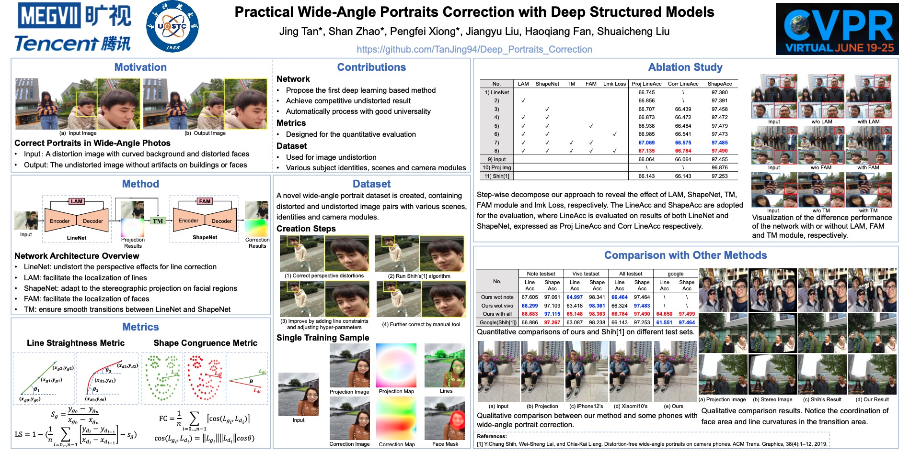

# Practical Wide-Angle Portraits Correction with Deep Structured Models
Jing Tan, Shan Zhao, Pengfei Xiong, Jiangyu Liu, Haoqiang Fan, Shuaicheng Liu

\[[arxiv](https://arxiv.org/abs/2104.12464)\] \[[BibTeX](#Citation)\]

<div align="center">
  
</div><br/>

## Note
In this repository, we will release dataset and pytorch implementation of our paper.

## Quick Start
Python 3.6+, Pytorch 1.2, torchvision 0.4, cuda10.0, and other requirements. 

All codes are tested on Linux.

### Installation
1. Clone the repository
   ```
   git clone https://github.com/TanJing94/Deep_Portraits_Correction.git
   cd Deep_Portraits_Correction
   ```


## Citation
If you find this work or code is helpful in your research, please cite:

```
@article{tan2021practical,
  title={Practical Wide-Angle Portraits Correction with Deep Structured Models},
  author={Tan, Jing and Zhao, Shan and Xiong, Pengfei and Liu, Jiangyu and Fan, Haoqiang and Liu, Shuaicheng},
  journal={arXiv preprint arXiv:2104.12464},
  year={2021}
}
```